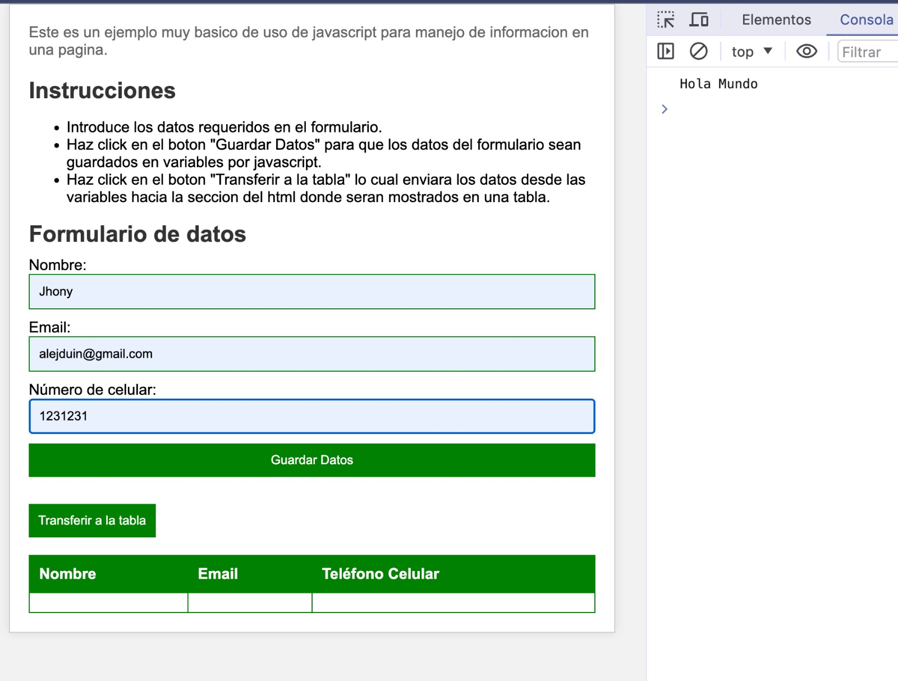
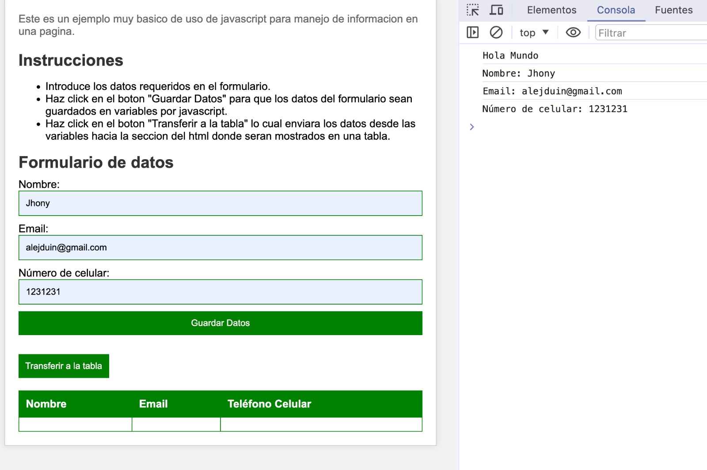
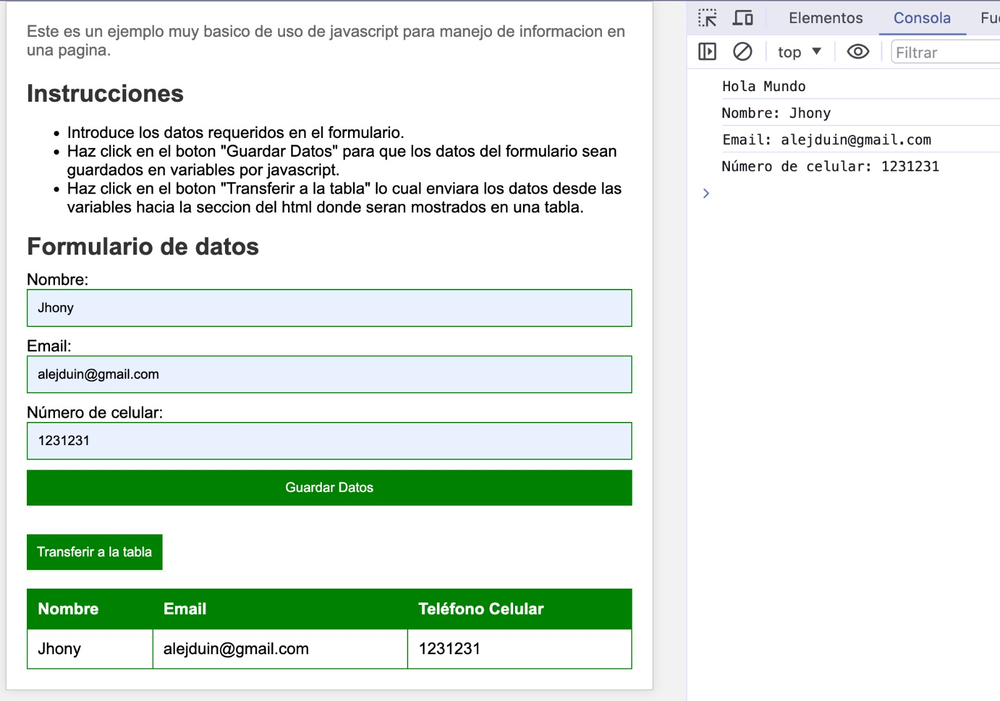

# Proyecto de Formulario a Tabla

Este proyecto permite al usuario ingresar datos en un formulario y luego visualizar esos datos en una tabla.

## Pasos para completar el paso de los datos del formulario a la tabla de valores

### Paso 1: Ingresar los datos en el formulario

En este paso, el usuario debe ingresar sus datos en los campos correspondientes del formulario.

### Paso 2: Enviar el formulario

Una vez que el usuario ha ingresado todos los datos requeridos, debe hacer clic en el botón "Enviar" para enviar el formulario.

### Paso 3: Visualizar los datos en la tabla

Después de enviar el formulario, los datos ingresados se mostrarán en la tabla de valores.
